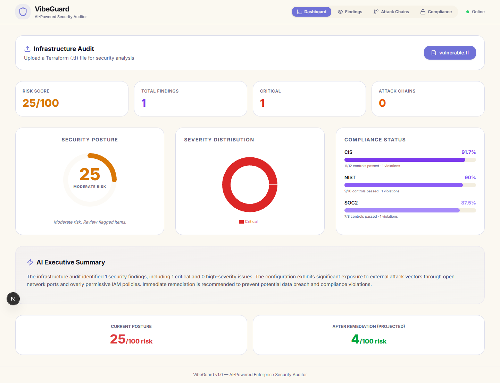
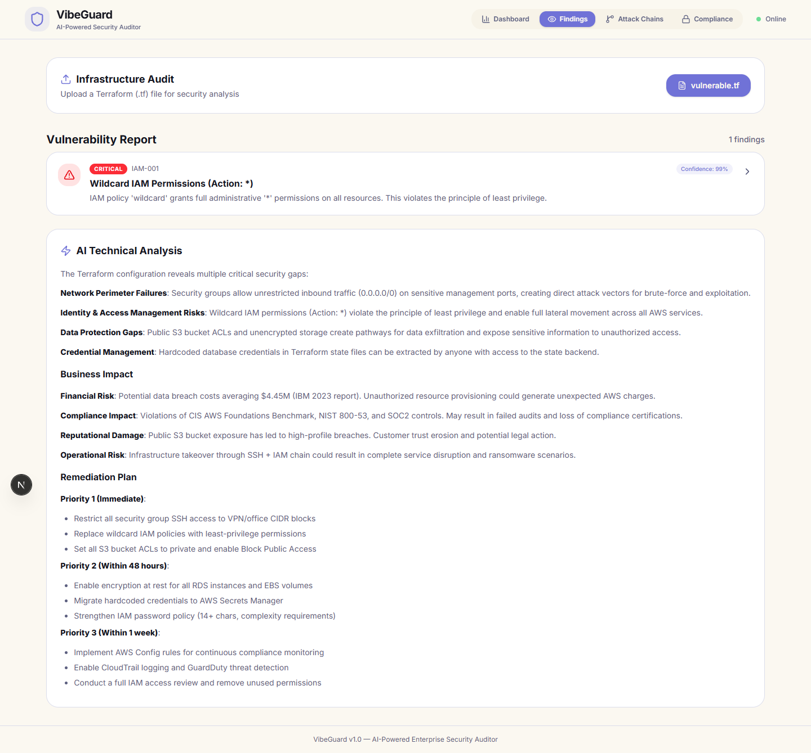
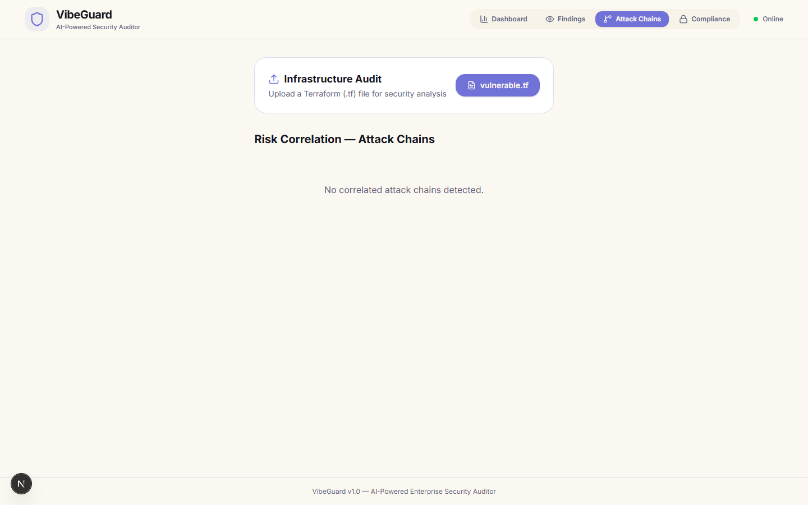
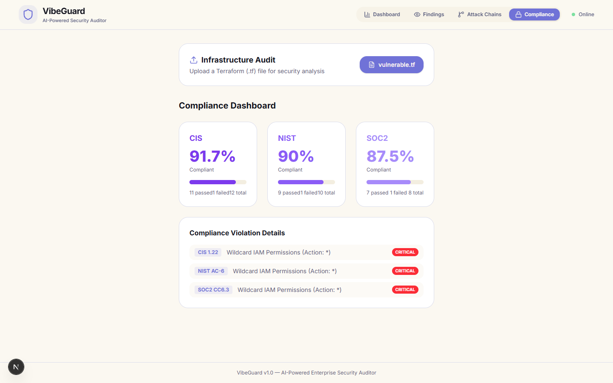

# VibeGuard - User Guide

Welcome to **VibeGuard**, an AI-powered enterprise infrastructure security auditor. VibeGuard helps you quickly analyze your Terraform files for security vulnerabilities and misconfigurations using both deterministic rules and advanced Google Gemini contextual AI.

This guide explains each major section of the VibeGuard interface, what it means, and why it is important for your security posture.

---

## 1. The Dashboard (Security Posture Overview)

The **Dashboard** gives you a high-level overview of the health of your infrastructure.

### Key Metrics
* **Risk Score**: A score out of 100 representing the security of your infrastructure. Lower scores mean you have critical or high-risk findings that need immediate attention. 
* **Total Findings**: The absolute number of vulnerabilities detected across your codebase.
* **Severity Distribution**: A visual breakdown showing how many Critical, High, Medium, and Low severity issues exist. 

**Why it's important**: The Dashboard acts as your command center. At a glance, engineering leaders and security teams can determine if an infrastructure deployment is safe to proceed or if remediation is required before applying the changes.

---

## 2. Findings (Vulnerability Report & AI Analysis)

The **Findings** tab dives deep into each specific vulnerability found in your code. 

### Features
* **Vulnerability Report**: A list of all flagged issues, categorized by severity. It points directly to the resource (e.g., `aws_security_group.allow_all`) and provides the remediation code.
* **AI Technical Analysis**: An advanced analysis generated by Google Gemini. It reads the deterministic findings *in the context of your whole file*.
* **Business Impact & Remediation Plan**: The AI contextualizes the technical flaws into business risks (e.g., potential data breaches, compliance fines) and provides a step-by-step remediation plan prioritizing the most critical fixes.

**Why it's important**: Deterministic scanners often generate noise and false positives. By coupling rule-based scans with AI reasoning, VibeGuard gives you actionable context. It tells you not only *what* is wrong, but *why* it matters to your business and *how* to fix it immediately.

---

## 3. Attack Chains (Risk Correlation)

The **Attack Chains** tab is where VibeGuard truly shines. It connects the dots between seemingly isolated vulnerabilities.

### Features
* **Visual Workflows**: Displays how an attacker could chain multiple misconfigurations to achieve a complete system compromise.
* **Example**: An open SSH port (Medium risk) combined with an overly permissive IAM wildcard policy (High risk) creates a **Critical Attack Chain** where an attacker could gain initial access and escalate privileges to wipe your entire AWS account.

**Why it's important**: Security risks don't happen in a vacuum. A low-level finding might not seem dangerous alone, but when chained with another misconfiguration, it becomes critical. This view allows security teams to prioritize fixes that break the attack chain, significantly reducing the blast radius of potential attacks.

---

## 4. Compliance (Framework Mapping)

The **Compliance** tab maps your findings to industry-standard regulatory frameworks.

### Supported Frameworks
* **CIS AWS Foundations Benchmark**
* **NIST 800-53**
* **SOC2**
* **PCI-DSS**

### Features
* **Percentage Compliant**: See exactly what percentage of a specific framework's controls you are currently satisfying.
* **Control Violations**: Detailed list showing exactly which findings violate which specific regulatory controls (e.g., `CIS 4.1` or `SOC2 CC6.1`).

**Why it's important**: Achieving and maintaining compliance is often a tedious manual process. This dashboard automates the translation of technical vulnerabilities into compliance language, helping DevOps teams quickly satisfy auditor requirements and ensuring the company avoids regulatory fines.

---

*Generated by VibeGuard v1.0*
